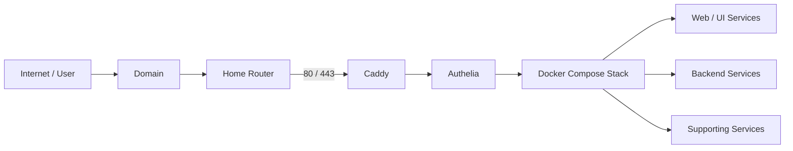

<div align="center">

# Dmitry · LePaVuki

### Aspiring DevOps Engineer

**Linux · Docker · Automation · CI/CD · Networking · Security**

<a href="https://github.com/LePaVuki">
  
</a>
<a href="mailto:pavuki2000@gmail.com">
  
</a>

</div>

---

## About Me

I'm a self-taught programmer working toward a career in **DevOps and infrastructure engineering**.

My practical experience is centered around **Linux, Docker Compose, Git/GitHub, GitHub Actions, networking, reverse proxies, TLS, authentication, security hardening, and self-hosted infrastructure**.

I prefer learning by building and operating real systems: automating service management, securing exposed services, designing container networks, and turning repeatable manual tasks into scripts and workflows.

---

## Core Technology Stack

### DevOps & Automation

<p align="left">
<a href="https://www.docker.com/" target="_blank"></a>
<a href="https://docs.docker.com/compose/" target="_blank"></a>
<a href="https://www.linux.org/" target="_blank"></a>
<a href="https://ubuntu.com/" target="_blank"></a>
<a href="https://git-scm.com/" target="_blank"></a>
<a href="https://github.com/features/actions" target="_blank"></a>
</p>

- **Linux / Ubuntu** — permissions, users/groups, package management, SSH and service administration
- **Docker / Docker Compose** — containerization, multi-container stacks and container networking
- **Git / GitHub** — trunk-based development, branches, pull requests and repository workflows
- **GitHub Actions** — automated testing, matrix builds, artifacts, secrets, notifications and semantic versioning
- **Python / Bash** — scripting, automation and tooling

### Networking & Security

<p align="left">
<a href="https://caddyserver.com/" target="_blank"></a>
<a href="https://www.authelia.com/" target="_blank"></a>
<a href="https://www.ssh.com/academy/ssh" target="_blank"></a>
<a href="https://www.fail2ban.org/" target="_blank"></a>
<a href="https://documentation.ubuntu.com/server/how-to/security/firewalls/" target="_blank"></a>
</p>

- **Caddy** — reverse proxy, multiple subdomains and automatic TLS/ACME
- **DNS / HTTPS / TLS** — domain and service routing, certificates and encrypted access
- **UFW / fail2ban** — firewalling and brute-force protection
- **Authelia** — authentication and access control for self-hosted services
- **Secrets** — generated secrets, `.env` configuration and read-only container mounts

### Application, Database & Monitoring

<p align="left">
<a href="https://www.python.org/" target="_blank"></a>
<a href="https://www.mysql.com/" target="_blank"></a>
<a href="https://prometheus.io/" target="_blank"></a>
<a href="https://grafana.com/" target="_blank"></a>
</p>

- **MySQL** — application database usage in a Docker-based environment
- **Prometheus / Grafana** — foundational experience with metrics collection and dashboards

---

## Featured Projects

<div align="center">

<a href="https://github.com/LePaVuki/Home-Circus">
  
</a>
<a href="https://github.com/LePaVuki/angular-react-DevOps-case">
  
</a>
<a href="https://github.com/LePaVuki/ESRP">
  
</a>

</div>

### Why these projects?

**[Home-Circus](https://github.com/LePaVuki/Home-Circus)** is the strongest demonstration of my current infrastructure work: Docker Compose, container networking, Caddy, automatic TLS, Authelia, secret generation, Bash automation and Git-based operations. fileciteturn3file0L1-L6

**[angular-react-DevOps-case](https://github.com/LePaVuki/angular-react-DevOps-case)** demonstrates practical GitHub Actions work, including automated testing, matrix builds, artifacts, secrets, custom workflow actions, notifications and semantic versioning. fileciteturn4file0L1-L6

**[ESRP](https://github.com/LePaVuki/ESRP)** demonstrates Python application development and MySQL integration in a Docker-based environment. fileciteturn5file0L1-L6

---

## Home-Circus Architecture

The project is intentionally small enough to operate on home infrastructure while still covering several real-world infrastructure concerns.



### Operational workflow

```text
Git repository
      │
      ▼
   git pull
      │
      ▼
   menu.sh
   ┌──┼───────────────┐
   │  │               │
 init start          stop
   │
   ├── generate secrets
   ├── prepare configuration
   └── apply container permissions
```

The current deployment is deliberately manual: repository updates are pulled to the host and the project management script controls stack initialization and lifecycle. **Automated deployment is a future improvement rather than a claimed capability.**

---

## Infrastructure & Security

I also maintain an **Ubuntu VPS** and have practical experience with:

- SSH administration
- UFW firewall configuration
- fail2ban
- TLS-secured services
- Linux package, user and permission management
- Xray / VLESS Reality server administration

My infrastructure experience is currently focused on **self-hosted and VPS environments**, rather than public cloud platforms.

---

## Currently Learning

| Area | Focus |
| --- | --- |
| **Terraform** | Infrastructure as Code and declarative infrastructure management |
| **Ansible** | Repeatable server provisioning and configuration management |
| **Prometheus / Grafana** | Metrics collection, dashboards and practical monitoring |

---

## Other Interests

### IoT & Embedded Systems

<a href="https://www.arduino.cc/" target="_blank"></a>
<a href="https://www.espressif.com/en/products/socs/esp32" target="_blank"></a>
<a href="https://mqtt.org/" target="_blank"></a>

ESP32 / ESP8266, MQTT, OTA firmware updates and Arduino IDE.

### 3D Content Creation

<a href="https://www.blender.org/" target="_blank"></a>
<a href="https://www.adobe.com/products/substance3d/apps/painter.html" target="_blank"></a>
<a href="https://unity.com/" target="_blank"></a>

3D modelling and asset creation in Blender; texturing, materials and Smart Materials in Substance Painter; real-time 3D development in Unity.

---

## GitHub Metrics

<div align="center">

<a href="https://github.com/LePaVuki">
  
</a>
<a href="https://github.com/LePaVuki">
  
</a>

<a href="https://github.com/LePaVuki">
  
</a>

</div>

---

## Contact

<p align="left">
<a href="mailto:pavuki2000@gmail.com"></a>
<a href="https://github.com/LePaVuki"></a>
</p>

---

<p align="center">
  <i>Building, automating, and operating systems while continuously improving my DevOps practice.</i>
</p>
